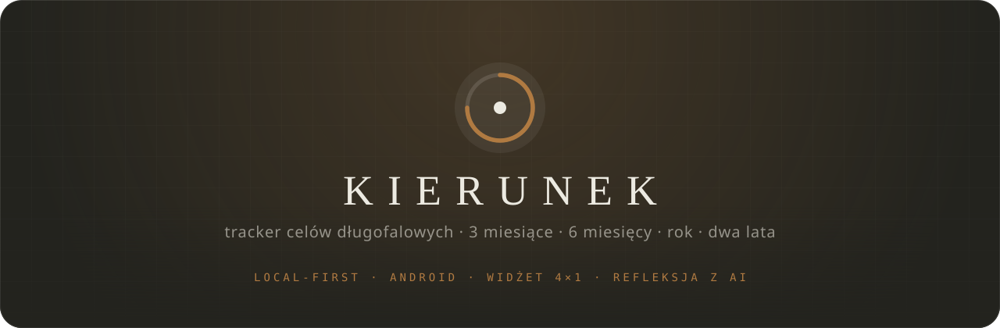
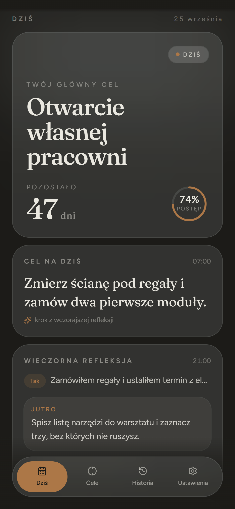
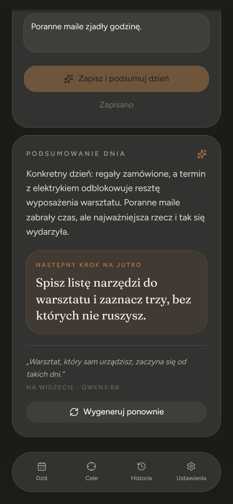
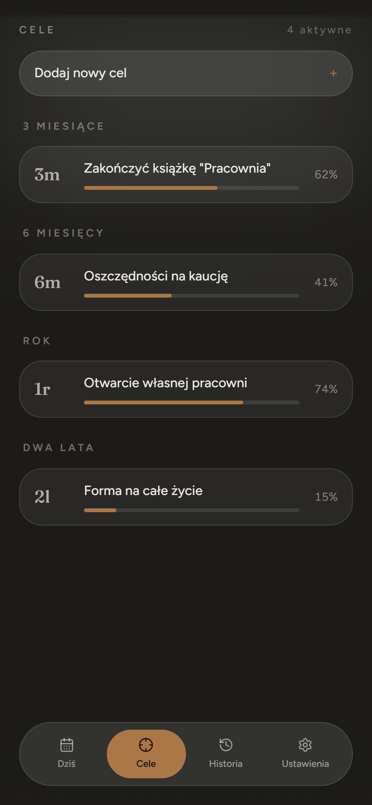
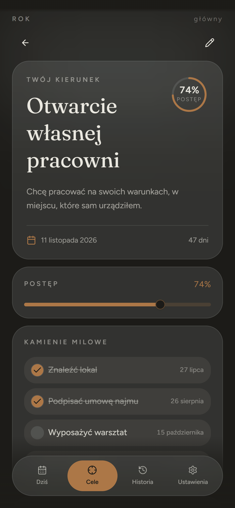
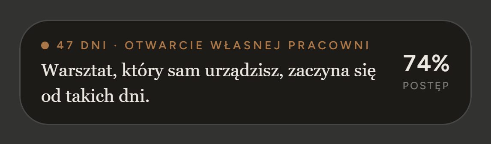
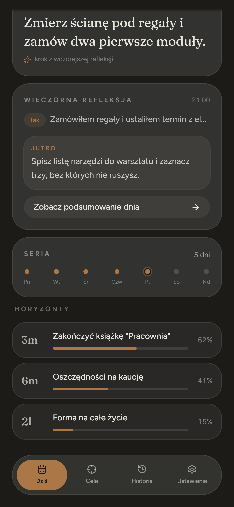
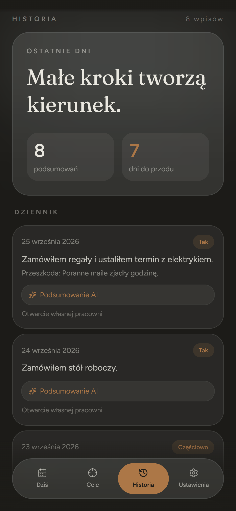
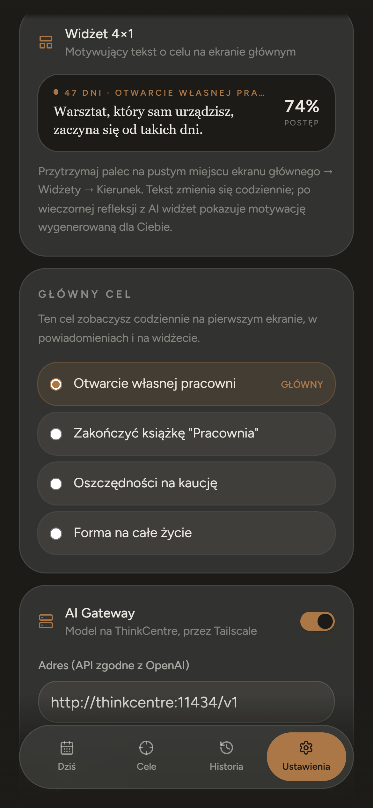

<p align="center">
  
</p>

<p align="center">
  
  
  
  
  
  
</p>

<p align="center">
  <sub>RANO — DOKĄD ZMIERZASZ &nbsp;·&nbsp; WIECZOREM — CZY DZIEŃ CIĘ PRZYBLIŻYŁ</sub>
</p>

<br>

<table align="center">
  <tr>
    <td align="center"><br><sub>DZIŚ</sub></td>
    <td align="center"><br><sub>REFLEKSJA</sub></td>
    <td align="center"><br><sub>HORYZONTY</sub></td>
    <td align="center"><br><sub>CEL</sub></td>
  </tr>
</table>

<p align="center">
  <br>
  <sub>WIDŻET 4×1 · TEKST ZMIENIA SIĘ CODZIENNIE</sub>
</p>

<p align="center"><sub>Zrzuty pokazują dane przykładowe dostępne w aplikacji.</sub></p>

<br>

## ◦ Idea

Jeden główny cel na 3 miesiące, 6 miesięcy, rok albo dwa lata — i dwa krótkie momenty skupienia
dziennie. **Rano** powiadomienie przypomina, dokąd zmierzasz. **Wieczorem** odpowiadasz, czy dzień
Cię przybliżył, a model na Twoim serwerze pisze krótkie podsumowanie i **jeden konkretny krok na
jutro**. Ten krok wraca rano w powiadomieniu, a motywacja ląduje na widżecie ekranu głównego.

Bez kont, bez chmury. Dane zostają na telefonie, a AI działa na Twoim sprzęcie.

<br>

## ◦ Rytm dnia

```text
 07:00  ○  CEL NA DZIŚ ─────────── krok zaplanowany wczoraj wieczorem
          ·
          ·   widżet 4×1 ─────── pozostałe dni · motywacja · postęp
          ·
 21:00  ●  WIECZORNA REFLEKSJA ── Tak / Częściowo / Nie + dwie linijki
          │
          ├─▶ AI Gateway  (model na własnym serwerze, przez Tailscale)
          └─▶ podsumowanie lokalne, gdy modelu nie ma albo nie odpowiada
                 ├─ summary    ──▶ Historia
                 ├─ nextStep   ──▶ jutro 07:00
                 └─ motivation ──▶ widżet
```

<br>

## ◦ Co jest w środku

| | |
| --- | --- |
| **Horyzonty** | Cele na 3m · 6m · 1r · 2l, data docelowa, „po co”, kamienie milowe z terminami, postęp |
| **Dziś** | Główny cel, pozostałe dni, pierścień postępu, „Cel na dziś”, seria tygodnia |
| **Refleksja** | Odpowiedź, co zrobiłeś, co przeszkodziło → podsumowanie dnia i następny krok |
| **AI Gateway** | Każdy serwer zgodny z OpenAI: Ollama, LiteLLM, vLLM, llama.cpp — z listą modeli i testem połączenia |
| **Bez AI** | Lokalne podsumowanie z reguł (tempo vs czas, seria, najbliższy kamień milowy) |
| **Powiadomienia** | Dokładne godziny (`USE_EXACT_ALARM`), 14 dni do przodu, przywracane po restarcie |
| **Widżet 4×1** | Natywny `AppWidgetProvider`, sam liczy dni i rotuje teksty bez otwierania aplikacji |
| **Prywatność** | localStorage w WebView + kopia zapasowa Androida; do modelu trafia tylko kontekst celu |

<br>

<table align="center">
  <tr>
    <td align="center"><br><sub>PO REFLEKSJI</sub></td>
    <td align="center"><br><sub>HISTORIA</sub></td>
    <td align="center"><br><sub>USTAWIENIA</sub></td>
  </tr>
</table>

<br>

## ◦ Start

```sh
bun install                # albo npm i
npm run dev                # web  → http://localhost:5173
npm run android:install    # APK  → telefon podłączony po USB
npm run mock:gateway       # atrapa AI Gateway do testów
```

Android: Node 20+, JDK 21, Android SDK 36. Szczegóły, w tym instalacja na Xiaomi/POCO (HyperOS),
są w [docs/android.md](docs/android.md).

<br>

## ◦ AI Gateway

```text
Ustawienia → AI Gateway
  adres   http://<serwer-w-tailscale>:11434/v1
  model   dowolny z GET /v1/models
  klucz   opcjonalny · Authorization: Bearer …
```

Model zwraca `{ summary, nextStep, motivation }`. Parser toleruje bloki `<think>` i markdown wokół
JSON-a. Kontrakt, prompt i propozycje modeli: [docs/ai-gateway.md](docs/ai-gateway.md).

<br>

## ◦ System

```text
 src/
 ├─ routes/            Dziś · Refleksja · Cele · Cel · Historia · Ustawienia
 ├─ lib/
 │  ├─ goals.ts        daty, dni, seria, kamienie milowe
 │  ├─ motivation.ts   teksty widżetu i powiadomień
 │  ├─ ai.ts           klient AI Gateway + prompt + parser
 │  ├─ reflection-local.ts   podsumowanie bez modelu
 │  ├─ native.ts       powiadomienia + most do widżetu
 │  └─ storage.ts      zapis i migracja danych
 └─ context/app-state.tsx
 android/app/src/main/java/com/devqube/kierunek/
 └─ GoalWidgetProvider · GoalWidgetPlugin · MainActivity
```

Pełna mapa i przepływ danych: [docs/README.md](docs/README.md).

<br>

## ◦ Design

`#23231E` atrament &nbsp;·&nbsp; `#B07A41` bursztyn &nbsp;·&nbsp; `#ECEAE1` papier &nbsp;·&nbsp;
**Fraunces** w nagłówkach &nbsp;·&nbsp; **Figtree** w treści &nbsp;·&nbsp; matowe szklane karty


Ikona to pierścień z łukiem postępu na 75% i punktem celu — ten sam motyw co na ekranie „Dziś”.
Ma wariant monochromatyczny pod ikony tematyczne Androida 13+.

<br>

---

<sub>Zbudowane w [Lovable](https://lovable.dev/projects/857fc7ac-6761-4621-a374-16050711f34d) i rozwijane lokalnie. Zmiany wypchnięte na `main` synchronizują się z edytorem Lovable.</sub>
